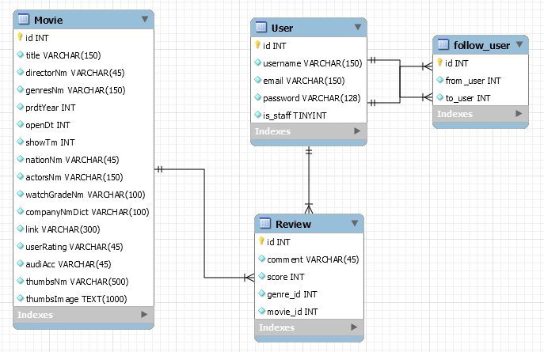

# Final_Project

## 팀원 정보 및 업무 분담 내역

- 김윤재: DB 모델링, 추천 알고리즘 구현

- 배성호: 뷰 컴포넌트 구성 및 구현

- 이한얼: 영화 데이터 수집 및 DB 적용

  

## 목표 서비스 구현 및 실제 구현 정도

- 영화 추천 서비스 구현

- 개발 아키텍처: Django REST API 서버(djangorestframework) + VueJS(Node, SFC)

- 유저의 최신 영화 선택에 따라 적절한 추억의 영화 추천

- 일자별 업무 진행 정도

  - 11/21(목): 조 편성 및 프로젝트 주제 선정, 기획
  - 11/22(금): 역할 분담, 필요한 자료 수집, 계획 수립
  - 11/23(토)~24(일): 영진위, 네이버 영화 API 분석, DB 모델링, Vue 컴포넌트 구조 설계
  - 11/25(월): 회원가입, 로그인, 로그아웃 구현
  - 11/26(화): 관리자 페이지 구현
  - 11/27(수): 유저의 영화 선택, 추천 알고리즘 구현
  - 11/28(목): 최적화, 디버깅, 에러페이지 구성

  

## 데이터베이스 모델링(ERD)

## 핵심 기능

- 

## 배포 서버 URL

## 기타 (느낀점)

- 김윤재

   일주일 동안 주로 Django(백엔드)를 맡아 프로그램을 구현했습니다. 프로젝트를 진행하면서 데이터를 수집, 적용하는 파트와 프론트엔드와의 상호작용적인 부분에서 백엔드는 가교 역할을 한다고 느꼈습니다. 때문에 데이터의 종류, 양, 목표 서비스를 고려해 모델링을 하고, 프론트엔드의 요청을 받아 이에 맞는 응답을 보내줄 때 해당 파트의 팀원들과 많은 의사소통을 하려고 노력했던 것 같습니다. 또한, 추천 알고리즘을 여러 구현하는 방식에 대해서 알아볼 수 있었고, 완성도는 조금 떨어지지만 content-based filtering 방식을 통해 유저의 영화 선택에 따른 영화 추천 알고리즘을 작성해볼 수 있었습니다. 이후에는, colloabrative filtering 방식, 혹은 두 방식이 결합된 hybrid filtering 방식을 구현해 유저의 과거 행동 데이터를 통해 영화를 추천하는 방법을 구현해보고 싶습니다.

- 배성호

- 이한얼